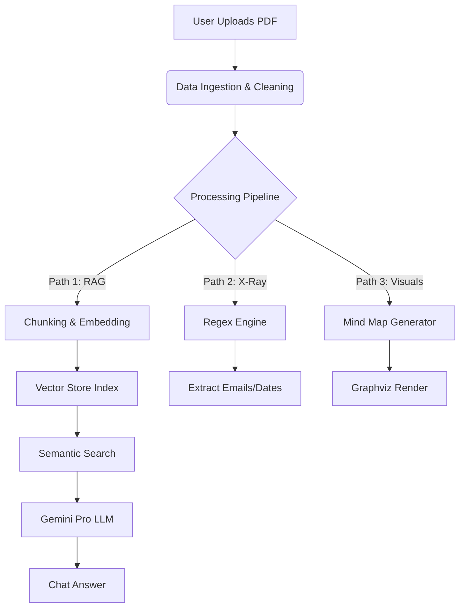

# 🧠 CognitiveDoc

> **Interact with your documents like never before.**
> A Multimodal RAG-based AI Assistant that transforms static PDFs into interactive conversations, visual mind maps, and gamified knowledge checks.


---

## 📖 Overview

**CognitiveDoc** is a comprehensive document analysis platform designed to solve the problem of information overload. By leveraging **Retrieval-Augmented Generation (RAG)**, it allows users to "talk" to their documents (PDF, DOCX, TXT) with high semantic accuracy.

Unlike standard chatbots, this application creates a **hybrid intelligence** environment by combining:
1.  **Generative AI (Gemini Pro)** for reasoning and summarization.
2.  **Deterministic Regex** for 100% accurate metadata extraction (X-Ray).
3.  **Graph Theory (Graphviz)** for visual concept mapping.

---

## 🚀 Key Features

### 🤖 **1. Intelligent RAG Chat**
* **Context-Aware:** Uses `VectorStoreIndex` to retrieve only the top 2 relevant chunks, ensuring accuracy and saving tokens.
* **Memory:** Retains chat history using `st.session_state`, allowing for natural, multi-turn conversations.
* **Persona Modes:** Toggle between *Eli5*, *Skeptic*, and *Academic* response styles.

### 🔍 **2. Document X-Ray**
* Instantly extracts structured data without hallucination using optimized Regex patterns:
    * 📧 **Emails**
    * 📅 **Dates** (ISO, US, and Text formats)
    * 📞 **Phone Numbers**

### 🕸️ **3. Visual Mind Maps**
* Transforms unstructured text into a **Directed Graph**.
* The AI identifies relationships (`Entity A -> Entity B`), and **Graphviz** dynamically renders a downloadable diagram.

### 🎮 **4. Gamified Learning**
* **Auto-Quiz Engine:** Automatically generates multiple-choice questions from the document content.
* **Active Recall:** Helps users verify their understanding immediately after reading.

### 🗣️ **5. Multimodal Accessibility**
* **Audio Response:** Text-to-Speech integration via `gTTS`.
* **Global Reach:** Real-time translation of answers into **Hindi, Spanish, French**, and more using `DeepTranslator`.

---

## 🛠️ Tech Stack

| Component | Technology Used | Purpose |
| :--- | :--- | :--- |
| **Frontend** | **Streamlit** | UI, State Management, Caching |
| **LLM Orchestration** | **LlamaIndex** | RAG Pipeline, Node Parsing, Indexing |
| **AI Models** | **Google Gemini Pro** | Generation & Embeddings (`models/embedding-001`) |
| **Data Processing** | **Pandas, Regex** | Structured extraction & Text analysis |
| **Visualization** | **Graphviz** | Knowledge Graph generation |
| **File Handling** | **PyMuPDF (fitz)** | High-speed PDF text extraction |
| **Audio/Translation** | **gTTS, DeepTranslator** | Accessibility features |

---

## ⚙️ Architecture


## 💻 Installation & Setup

Follow these steps to set up the project locally.

### Prerequisites
* Python 3.9 or higher
* A Google Cloud API Key (for Gemini)
* Git installed on your system

### 1. Clone the Repository
Open your terminal or command prompt and run:
```bash
git clone [https://github.com/yourusername/CognitiveDoc.git](https://github.com/yourusername/CognitiveDoc.git)
cd CognitiveDoc
```

### 2. Create a Virtual Environment (Recommended)

It is best practice to use a virtual environment to avoid dependency conflicts.

```bash
# Windows
python -m venv venv
.\venv\Scripts\activate

# Mac/Linux
python3 -m venv venv
source venv/bin/activate

```

### 3. Install Dependencies

```bash
pip install -r requirements.txt

```

*Note: This project requires `graphviz` to be installed on your system. If you are on Windows, download the installer from [graphviz.org](https://graphviz.org/download/).*

### 4. Configure API Keys

This project requires a **Google Gemini API Key**.

1. Get your key from [Google AI Studio](https://aistudio.google.com/).
2. Create a file named `.env` in the root folder.
3. Add the following line:
```env
GOOGLE_API_KEY=your_actual_api_key_here

```


*(Alternatively, you can use `.streamlit/secrets.toml` for Streamlit Cloud deployment).*

### 5. Run the Application

```bash
streamlit run StreamlitApp.py

```

---

## 📂 Project Structure

This project follows a modular architecture to separate backend logic from frontend UI.

```bash
CognitiveDoc/
├── QAWithPDF/                 # 🧠 Backend Logic Package
│   ├── __init__.py
│   ├── data_ingestion.py      # Handles PDF/DOCX file loading
│   ├── embedding.py           # Connects to Google Embedding Model
│   └── model_api.py           # Configures Gemini Pro LLM
│
├── StreamlitApp.py            # 🖥️ Main Frontend Application (Entry Point)
├── requirements.txt           # 📦 Python Dependencies
├── .env                       # 🔑 API Keys (Not committed to Git)
└── README.md                  # 📄 Documentation

```

---

## 🔮 Future Improvements

Here is the roadmap for the next version of CognitiveDoc:

* [ ] **Persistent Vector Storage:** Migrate from in-memory storage to **Pinecone** or **ChromaDB** to support millions of documents without reloading.
* [ ] **OCR Integration:** Add `pytesseract` to extract text from scanned PDFs (images).
* [ ] **Voice Input:** Implement `speech_recognition` to allow users to ask questions via microphone.
* [ ] **Docker Support:** Containerize the application for easier deployment.

---

## 🤝 Contributing

Contributions are welcome!

1. Fork the Project
2. Create your Feature Branch (`git checkout -b feature/AmazingFeature`)
3. Commit your Changes (`git commit -m 'Add some AmazingFeature'`)
4. Push to the Branch (`git push origin feature/AmazingFeature`)
5. Open a Pull Request


---

**Created by Avinash Padidadakala**

```

```
